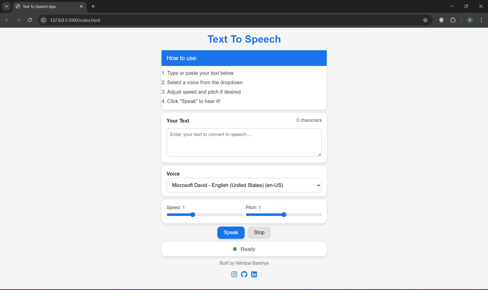

# Text To Speech App

<p align="left">
  
  
  
  
  
</p>

[](https://nilotpal04.github.io/Text-To-Speech/)

A clean and simple Material UI–styled web application that converts user-entered text into speech using the **Web Speech API**.  
Built with **HTML, CSS, and JavaScript**.

---

## 🚀 Features

- Convert any text into speech  
- Choose from available system voices  
- Adjust **speech speed (rate)**  
- Adjust **pitch**  
- Live **character counter**  
- Speaking/Stopped/Ready **status indicator**  
- Modern Material UI interface  
- Footer with social media links  

---

## 🛠️ Tech Stack

- **HTML5**
- **CSS3** (Material UI inspired)
- **JavaScript**
- **Web Speech API**

---

## 📸 Live Demo Screenshot

<p align="center">
  
</p>


---

## 📦 How It Works

1. User enters text in the input box  
2. Web Speech API generates speech using `SpeechSynthesisUtterance`  
3. User can:
   - Pick a voice  
   - Adjust speed  
   - Adjust pitch  
4. App updates status dynamically:
   - **Ready**
   - **Speaking…**
   - **Stopped**

---

## 🔧 Installation & Setup

No special setup required.  
Just open the `index.html` file in any modern browser.

Or run a simple local server:

```bash
live-server


